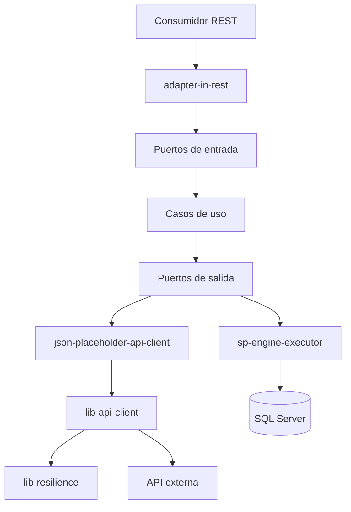

# Java WebFlux Driven Adapters

<p align="center">
  
  
  
  
</p>

<p align="center">
  
  
  
  
  
  
  
</p>

Repositorio de referencia para centralizar, consultar y reutilizar librerías y adaptadores reactivos en proyectos Java. La solución implementa **Clean Architecture + Arquitectura Hexagonal**, separa el dominio de la infraestructura y proporciona ejemplos funcionales de integración HTTP y ejecución de procedimientos almacenados sobre SQL Server.

> Proyecto base construido con Java 21, Spring Boot 4.1.1, Spring WebFlux, Project Reactor, R2DBC y Gradle.

## Contenido

- [Objetivo](#objetivo)
- [Características](#características)
- [Tecnologías](#tecnologías)
- [Arquitectura](#arquitectura)
- [Módulos](#módulos)
- [Flujos principales](#flujos-principales)
- [Requisitos](#requisitos)
- [Configuración](#configuración)
- [Ejecución local](#ejecución-local)
- [API REST](#api-rest)
- [Cliente HTTP genérico](#cliente-http-genérico)
- [Resiliencia](#resiliencia)
- [Manejo de errores](#manejo-de-errores)
- [Observabilidad y logging](#observabilidad-y-logging)
- [Pruebas y cobertura](#pruebas-y-cobertura)
- [Cómo agregar un adaptador](#cómo-agregar-un-adaptador)
- [Buenas prácticas de seguridad](#buenas-prácticas-de-seguridad)

## Objetivo

Este repositorio funciona como catálogo técnico y proyecto de consulta para:

- Mantener adaptadores de entrada y salida desacoplados del negocio.
- Reutilizar un cliente HTTP reactivo configurable por operación.
- Aplicar timeout, retry y circuit breaker sin contaminar los casos de uso.
- Ejecutar sentencias o procedimientos almacenados SQL Server mediante R2DBC.
- Estandarizar respuestas, excepciones, logging y observabilidad.
- Servir como referencia para nuevos microservicios WebFlux.

El módulo `json-placeholder-api-client` representa una integración externa de ejemplo. Puede utilizarse como plantilla para construir adaptadores reales sin acoplar el dominio a WebClient.

## Características

- Programación reactiva no bloqueante con `Mono` y `Flux`.
- Rutas funcionales de Spring WebFlux.
- Separación por puertos de entrada y salida.
- Cliente HTTP genérico con endpoints declarados en YAML.
- Propagación automática de `Correlation-Id`.
- Composición de headers globales, headers del endpoint y headers de la solicitud.
- Soporte para path parameters, query parameters y body.
- Circuit breaker, retry y time limiter con Resilience4j Reactor.
- Ejecución R2DBC de múltiples result sets.
- Parámetros SQL nombrados y contenido SQL almacenado en Base64.
- Respuestas de error basadas en RFC 9457 mediante `ProblemDetail`.
- Enmascaramiento configurable de información sensible en logs.
- Actuator, métricas y endpoint de Prometheus.
- OpenAPI y Swagger UI.
- Cobertura JaCoCo mínima configurada al 90 %.

## Tecnologías

| Tecnología | Versión/uso |
|---|---|
| Java | 21 |
| Spring Boot | 4.1.1 |
| Spring WebFlux | API reactiva y cliente HTTP |
| Project Reactor | `Mono` y `Flux` |
| R2DBC MSSQL | Acceso reactivo a SQL Server |
| Resilience4j | Circuit breaker, retry y time limiter |
| Springdoc OpenAPI | 3.0.3 |
| Gradle | Proyecto multimódulo y Version Catalog |
| JaCoCo | Cobertura de pruebas |
| JUnit 5 / Reactor Test | Pruebas unitarias y reactivas |
| WireMock | Pruebas de integraciones HTTP |

## Arquitectura



Las dependencias apuntan hacia el dominio. Los casos de uso conocen interfaces, no detalles de WebClient, R2DBC ni del protocolo HTTP.

## Módulos

| Módulo | Responsabilidad |
|---|---|
| `domain` | Modelos y excepciones independientes de infraestructura. |
| `application` | Puertos de entrada/salida y casos de uso. |
| `adapter-in-rest` | RouterFunctions, handlers y manejo global de errores. |
| `sp-engine-executor` | Adaptador R2DBC para SQL Server, parseo de parámetros y mapeo de result sets. |
| `json-placeholder-api-client` | Adaptador de ejemplo para consultar publicaciones externas. |
| `lib-api-client` | Cliente HTTP genérico y configurable basado en WebClient. |
| `lib-resilience` | Ejecución reactiva protegida por timeout, retry y circuit breaker. |
| `bootstrap` | Ensamblaje de módulos, configuración y clase principal. |

Estructura resumida:

```text
java-webflux-driven-adapters/
├── domain/
├── application/
├── adapter-in-rest/
├── sp-engine-executor/
├── json-placeholder-api-client/
├── lib-api-client/
├── lib-resilience/
├── bootstrap/
├── gradle/
├── build.gradle
└── settings.gradle
```

## Flujos principales

### Ejecución de procedimientos almacenados

1. El consumidor envía los parámetros al endpoint REST.
2. El handler crea un `StoredProcedureCommand`.
3. El caso de uso decodifica el contenido SQL configurado en Base64.
4. El adaptador identifica y enlaza los parámetros nombrados.
5. R2DBC ejecuta la sentencia y procesa todos los result sets de forma secuencial.
6. El mapper separa las filas de datos de la fila de estado.
7. La API retorna `data` y `status` en una respuesta uniforme.

La definición de resultado actualmente utiliza:

| Propiedad | Columna esperada |
|---|---|
| Código | `CodigoError` |
| Mensaje | `MensajeError` |
| Retorno | `ReturnValue` |
| Código exitoso | `-1` |

La comparación de nombres de columna no distingue mayúsculas de minúsculas. Si no se recibe una fila de estado, la respuesta se considera exitosa por defecto.

### Consulta de una API externa

El caso de uso `RetrievePostsUseCase` invoca el puerto `PostsGateway`. Su adaptador construye una solicitud genérica identificada por la operación `json-placeholder-retrieve-posts`, delega el transporte a `lib-api-client` y transforma los DTO externos al modelo `Post`.

## Requisitos

- JDK 21.
- SQL Server accesible, si se utilizará el ejecutor de procedimientos.
- Variables de entorno requeridas.
- Acceso a Internet para ejecutar el ejemplo de JSONPlaceholder.

No es necesario instalar Gradle: el repositorio incluye Gradle Wrapper.

## Configuración

### Variables de entorno

Cree un archivo `.env` local a partir de `.env.example` o configure las variables desde el entorno de ejecución:

```dotenv
DB_HOST=localhost
DB_PORT=1433
DB_NAME=nombre_base_datos
DB_USERNAME=usuario
DB_PASSWORD=contraseña
DB_SSL_ENABLED=false
DB_TRUST_SERVER_CERTIFICATE=false
STORED_PROCEDURE_CONTENT=<contenido_sql_codificado_en_base64>
TIMEZONE=UTC
```

`STORED_PROCEDURE_CONTENT` debe contener la sentencia completa codificada en Base64. La sentencia puede usar parámetros nombrados, por ejemplo `:cardNumber`; cada parámetro utilizado debe existir en `parameters` dentro de la solicitud REST.

> Spring Boot no carga archivos `.env` automáticamente. Expórtelos en la terminal, configúrelos en IntelliJ IDEA o utilice el mecanismo de variables de su plataforma de despliegue.

Ejemplo en Linux/WSL:

```bash
set -a
source .env
set +a
./gradlew :bootstrap:bootRun
```

En PowerShell:

```powershell
$env:DB_HOST = "localhost"
$env:DB_PORT = "1433"
$env:DB_NAME = "nombre_base_datos"
$env:DB_USERNAME = "usuario"
$env:DB_PASSWORD = "contraseña"
$env:STORED_PROCEDURE_CONTENT = "<base64>"
./gradlew.bat :bootstrap:bootRun
```

### Cliente HTTP genérico

Cada integración se registra bajo `adapters.generic-api-client.endpoints`:

```yaml
adapters:
  generic-api-client:
    default-headers:
      Accept: application/json

    endpoints:
      customer-retrieve:
        url: https://api.example.com/customers/{customerId}
        method: GET
        headers:
          Caller-Service: customer-query

    transport:
      connect-timeout: 2s
      read-timeout: 10s
      write-timeout: 10s
      max-in-memory-size: 2097152

    resilience:
      timeout: 12s
      circuit-breaker:
        failure-rate-threshold: 50
        slow-call-rate-threshold: 50
        slow-call-duration-threshold: 5s
        sliding-window-size: 20
        minimum-number-of-calls: 10
        wait-duration-in-open-state: 30s
        permitted-calls-in-half-open-state: 3
      retry:
        max-attempts: 2
        wait-duration: 200ms
```

La precedencia de headers es:

1. Headers predeterminados.
2. Headers configurados para el endpoint.
3. Headers recibidos en `ApiRequest`.

El nivel más específico sobrescribe al anterior. Finalmente se agrega `Correlation-Id`, generándolo cuando no fue proporcionado.

## Ejecución local

Compilar el proyecto:

```bash
./gradlew clean build
```

Ejecutar la aplicación:

```bash
./gradlew :bootstrap:bootRun
```

En Windows:

```powershell
./gradlew.bat clean build
./gradlew.bat :bootstrap:bootRun
```

La aplicación inicia por defecto en `http://localhost:8080`.

## API REST

### Ejecutar procedimiento almacenado

```http
POST /api/v1/stored-procedures/execute
Content-Type: application/json
Accept: application/json
```

Solicitud:

```json
{
  "parameters": {
    "cardNumber": "0004001123443210987",
    "country": "CO"
  }
}
```

Ejemplo de respuesta exitosa:

```json
{
  "data": [
    {
      "customerName": "CLIENTE DE EJEMPLO",
      "cardType": "CREDIT"
    }
  ],
  "status": {
    "success": true,
    "code": "-1",
    "message": ""
  }
}
```

Los nombres enviados en `parameters` deben coincidir exactamente con los placeholders presentes en el SQL decodificado.

Ejemplo con cURL:

```bash
curl --location 'http://localhost:8080/api/v1/stored-procedures/execute' \
  --header 'Content-Type: application/json' \
  --header 'Accept: application/json' \
  --data '{
    "parameters": {
      "cardNumber": "0004001123443219870",
      "country": "CO"
    }
  }'
```

### Consultar publicaciones de ejemplo

```http
GET /api/v1/posts
Accept: application/json
```

```bash
curl --location 'http://localhost:8080/api/v1/posts' \
  --header 'Accept: application/json'
```

Este endpoint consume `https://jsonplaceholder.typicode.com/posts` mediante el cliente genérico.

### Documentación y operación

| Recurso | URL |
|---|---|
| Swagger UI | `http://localhost:8080/swagger-ui.html` |
| OpenAPI JSON | `http://localhost:8080/v3/api-docs` |
| Health | `http://localhost:8080/actuator/health` |
| Info | `http://localhost:8080/actuator/info` |
| Métricas | `http://localhost:8080/actuator/metrics` |
| Prometheus | `http://localhost:8080/actuator/prometheus` |
| Circuit breakers | `http://localhost:8080/actuator/circuitbreakers` |
| Retries | `http://localhost:8080/actuator/retries` |

## Cliente HTTP genérico

El cliente acepta un `ApiRequest` con:

- Nombre lógico de la operación.
- Path parameters.
- Query parameters.
- Headers dinámicos.
- Body opcional.
- Correlation ID opcional.

Ejemplo desde un adaptador:

```java
ApiRequest request = ApiRequest.builder()
        .operation("customer-retrieve")
        .pathParams(Map.of("customerId", customerId))
        .queryParams(Map.of("include", "accounts"))
        .headers(Map.of("Authorization", token))
        .correlationId(correlationId)
        .build();

return genericApiClient.execute(request, CustomerResponseDto.class);
```

El cliente diferencia errores HTTP 4xx, errores 5xx, fallos de conexión y errores de deserialización mediante excepciones específicas del dominio.

## Resiliencia

`lib-resilience` aplica operadores reactivos por nombre de operación:

- **Time limiter:** limita el tiempo total permitido.
- **Retry:** reintenta fallos elegibles según la configuración.
- **Circuit breaker:** detiene temporalmente las llamadas cuando se supera el umbral de fallos o lentitud.

Cada endpoint debe utilizar un nombre de operación estable, ya que ese identificador relaciona configuración, métricas, logs y políticas de resiliencia.

## Manejo de errores

El manejador global responde con `application/problem+json`.

| Situación | HTTP | Código |
|---|---:|---|
| Parámetros SQL inválidos o faltantes | 400 | `INVALID_STORED_PROCEDURE_REQUEST` |
| Base de datos no disponible o timeout R2DBC | 503 | `DATABASE_UNAVAILABLE` |
| Error del proveedor SQL | 500 | `STORED_PROCEDURE_EXECUTION_ERROR` |
| Error inesperado | 500 | `INTERNAL_SERVER_ERROR` |

Ejemplo:

```json
{
  "type": "https://api.raulbolivar.com/errors/DATABASE_UNAVAILABLE",
  "title": "Service Unavailable",
  "status": 503,
  "detail": "Base de datos temporalmente no disponible",
  "instance": "/api/v1/stored-procedures/execute",
  "code": "DATABASE_UNAVAILABLE",
  "timestamp": "2026-08-30T12:00:00Z"
}
```

Cuando SQL Server informa un código de proveedor o `SQLState`, estos valores se agregan al Problem Detail del error de ejecución.

## Observabilidad y logging

La configuración incluye:

- Health probes de liveness y readiness.
- Métricas de aplicación y Resilience4j.
- Exportación compatible con Prometheus.
- Captura estructurada de solicitudes externas.
- Enmascaramiento de `authorization`, `password` y `clientSecret`.
- Enmascaramiento parcial de tarjetas, cuentas y datos de cliente.

Evite habilitar logs R2DBC en nivel `DEBUG` en producción si las sentencias o metadatos pueden revelar información sensible.

## Pruebas y cobertura

Ejecutar todas las pruebas:

```bash
./gradlew test
```

Ejecutar verificaciones, incluida la regla mínima de cobertura del 90 %:

```bash
./gradlew check
```

Generar el reporte HTML consolidado:

```bash
./gradlew jacocoMergedHtmlReport
```

El reporte se genera en:

```text
build/reports/jacoco/merged-html/index.html
```

## Cómo agregar un adaptador

1. Defina el modelo requerido en `domain`.
2. Cree el puerto de salida en `application/.../ports/out`.
3. Implemente el caso de uso contra ese puerto.
4. Cree un nuevo módulo de adaptador o use uno existente.
5. Implemente el gateway y sus mappers de DTO a dominio.
6. Registre la operación externa en `application.yml`, si utiliza el cliente genérico.
7. Agregue el módulo como dependencia de `bootstrap`.
8. Exponga el caso de uso mediante un handler y una ruta, si corresponde.
9. Cubra mapper, adaptador, caso de uso y escenarios de error con pruebas.

Convención recomendada:

```text
<sistema>-api-client/
└── src/main/java/.../
    ├── adapter/
    ├── config/
    ├── dto/
    └── mapper/
```

## Buenas prácticas de seguridad

- No versionar `.env`, contraseñas, tokens ni certificados.
- Mantener únicamente `.env.example` con valores ficticios.
- Rotar cualquier credencial que haya sido incorporada previamente a un ZIP o commit.
- Obtener secretos desde el gestor de secretos de la plataforma.
- No registrar bodies completos sin reglas de enmascaramiento verificadas.
- Restringir `/actuator/env` y otros endpoints operativos en ambientes compartidos.
- Habilitar validación TLS para SQL Server en producción y configurar el trust store correspondiente.
- Validar que el SQL Base64 provenga de una fuente controlada; codificar en Base64 no cifra ni protege el contenido.

## Estado del proyecto

El repositorio contiene la base arquitectónica y adaptadores funcionales iniciales. Los directorios de prueba están preparados, pero deben incorporarse pruebas suficientes antes de considerar el proyecto listo para producción, especialmente porque `check` exige una cobertura lineal mínima del 90 %.

## Autor

**Raúl Bolívar**  
Repositorio técnico de referencia para Java, Spring WebFlux y arquitecturas orientadas a puertos y adaptadores.

